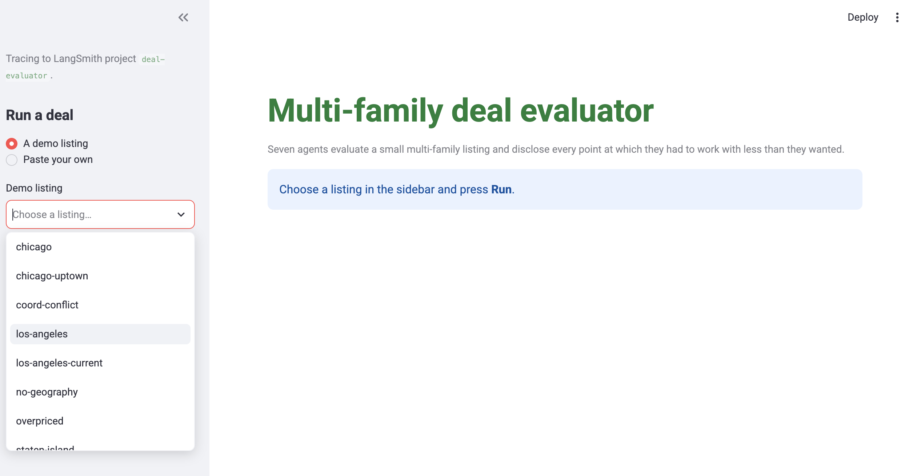
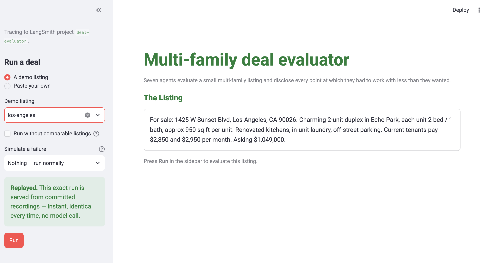
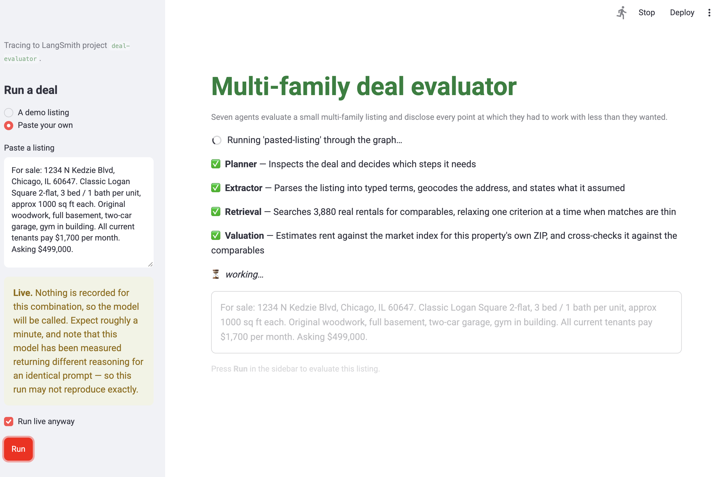
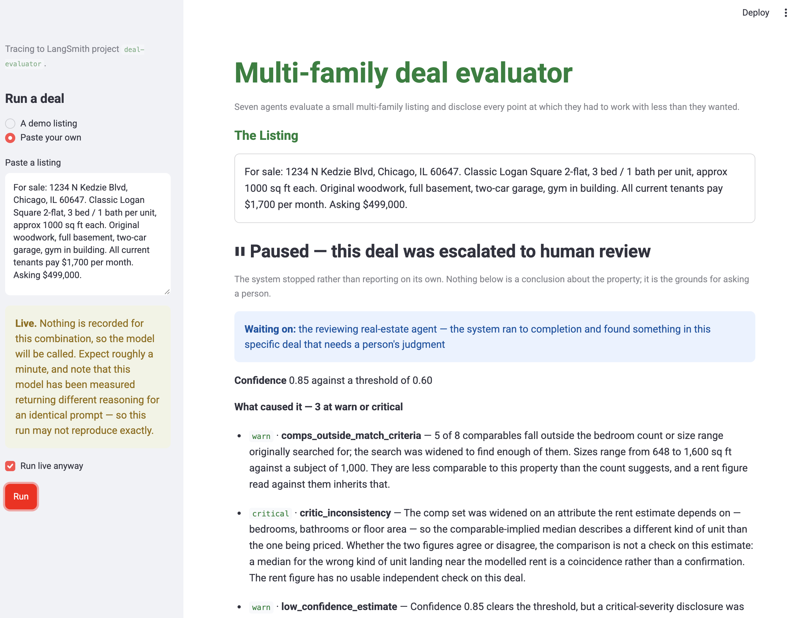
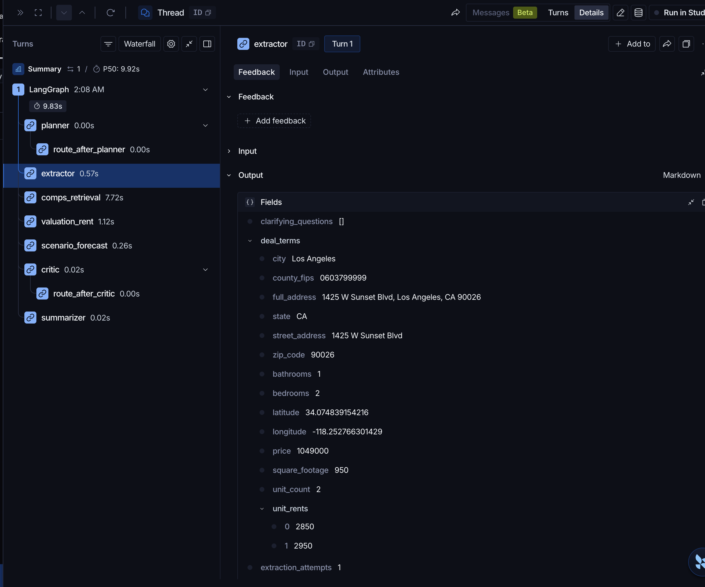

# Multi-Family Deal Evaluator

# Project Overview

This repository is for the **Multi-Family Deal Evaluator**, a capstone project for Carnegie Mellon's Agentic AI [Executive Education Program](https://execonline.cs.cmu.edu/agentic-ai-program). The Multi-Family Deal Evaluator is a seven-agent system that evaluates small multi-family (2-4 unit) properties for real estate investors. Given a listing, it automates extraction of deal terms, comp retrieval, rent estimation, scenario forecasting, and authors a final report.

Please note, because this is an academic project, the primary goal of this repository is for showcasing the design and implementation vs. deploying to production at scale. In order to fully run the code in this repository you will need to obtain some of the dependencies yourself as they are not checked in (e.g. some data, API Keys). Full instructions are in [**How To Run This Project**](#how-to-run-this-project) below.

# System Overview

A seven-agent pipeline orchestrated via a [LangGraph](https://github.com/langchain-ai/langgraph) state graph, with an explicit human-in-the-loop pause node.

<a href="docs/diagrams/deal_evaluator_graph_lr.png"></a>

*Generated from the compiled graph, not drawn. Dotted edges are conditional.*

## Agents

1. **Planner** — inspects the deal, decides which downstream steps run, routes between agents, governs retries and escalation.
2. **Extractor** — parses an unstructured listing into structured deal terms, resolves the address to coordinates, raises clarifying questions on anything it can't resolve.
3. **Comps/Retrieval** — a RAG comp finder over a rental-listings corpus (ChromaDB + sentence-transformers), adaptively relaxing search radius and match criteria when matches are sparse, and flagging when it does.
4. **Valuation/Rent** — a gradient-boosted rent regression model, anchored to a ZIP-level market rent index, cross-checked against the retrieved comps.
5. **Scenario/Forecast** — a Tree-of-Thought search over rent-growth and price-appreciation scenarios, scored by an LLM and pruned to a beam of survivors.
6. **Critic/Reviewer** — checks consistency across upstream outputs, aggregates every disclosure into a confidence score, and routes low-confidence or contradictory deals to a human-review pause rather than reporting them as settled.
7. **Summarizer** — renders the final report, required to surface every upstream disclosure rather than only the headline numbers.

## Coordination, state and memory

Fixed data dependencies dictate ordering; there is no parallelism or fan out. The Planner sets state pre-flight rather than supervising dynamically.

Memory is a typed Pydantic state object backed by SQLite checkpointing. Agents communicate exclusively through partial state updates with append-only disclosure logging for auditability; no agent directly invokes another. This ensures separation-of-concerns and clear auditability.

Human intervention is triggered by a LangGraph `interrupt()` call that pauses the graph and surfaces the reason why.

## Reasoning, retrieval and tools

The system is a hybrid system which combines deterministic logic with LLMs. Full runs execute **seven model calls across four agents**. Core decision-making (scoring, routing, buy/pass recommendations) relies on deterministic functions over accumulated state (vs. model calls).

- **Tree-of-Thought (Forecast)** runs beam search over an enumerated space: four framings of which years feed each series, then nine rent-band/price-band pairings. The model ranks and prunes; it never produces a growth rate. Every candidate and its prune reason reaches a ledger printed in the final report.
- **Adaptive RAG (Retrieval)** is a reason/act/observe loop. A shortfall is treated as an observation: concede one criterion, name it, then re-query.
- **Tools** come from a read-only MCP server, whose `list_tools()` builds the Forecast evaluator's menu (so the tool surface has one definition rather than two that can drift).
- **Logging** is LangSmith tracing across every node; **evaluation** invokes this same compiled graph.

## Core architectural principles

**Transparent Degradation, enforced structurally:** An agent proceeding on incomplete or relaxed evidence attaches a named, severity-graded flag defined in an enum, making coverage of the failure modes countable. An append-only reducer makes disclosure loss impossible. Flags propagate through the Critic to the Summarizer, so a report always says *when and how* the system deviated from the ideal path.

**Independent Decision Axes:** Confidence scoring (evidence quality) and deal quality (investment merit) are computed separately; a deal can require human review due to evidence flags while still remaining viable.

**Rule-Gated AI:** every model call sits upstream of a rule or beside one, never as the last word.

**Ground Assumptions in Data.** Every load-bearing assumption was tested against real data, and several failed, leading to iterative design revisions.

# Repository layout

```
.
├── README.md                       you are here
├── LICENSE                         MIT
├── data/README.md                  the gitignored datasets: source, license, size, and
│                                   the command that consumes each one
├── docs/
│   ├── implementation_plan.md      the plan of record; §7 is the decision register
│   ├── open_questions.md           every unresolved question, by system area
│   ├── project_stats.md            size and cost of the build, each figure with its recipe
│   ├── final_capstone_report_…md   the written submission
│   ├── demo.md                     the eight demo listings and what each one exists to show
│   ├── running_the_demo.md         how to launch the Streamlit surface, with and without tracing
│   ├── design/                     what the system IS — architecture, data sources, state
│   │                               schema, engineering standards, personas, limitations,
│   │                               the recommendation rule, the forecast evaluator
│   ├── history/                    how it got that way — decision_log.md, changelog.md
│   ├── tasks/                      per-unit task lists, and the conventions for them
│   ├── sample_reports/             three reports the pipeline produced, committed as-is
│   ├── diagrams/                   graph topology, generated from the compiled graph
│   └── images/                     demo-surface and tracing screenshots used by these docs
└── src/
    ├── main.py                     entrypoint — run the pipeline on one listing
    ├── app.py                      Streamlit demo surface
    ├── graph.py                    StateGraph assembly: nodes, edges, routing, compile
    ├── state.py                    the one typed state object, and the flag vocabulary
    ├── config.py                   every tunable parameter, with how each was set
    ├── nodes.py                    node-name constants
    ├── demo_deals.py               the demo listings and their calibration provenance
    ├── mcp_server.py               read-only MCP surface over the reference data
    ├── agents/                     planner, extractor, comps_retrieval, valuation_rent,
    │                               scenario_forecast, critic, human_review, summarizer
    ├── tools/                      data access and shared machinery — HUD FMR client,
    │   │                           geocoding, crosswalks, vector store, rent/price
    │   │                           series, beam search, LLM client and response cache
    │   ├── model/rent_model.py     the rent regression and its anchoring
    │   └── data/                   committed reference tables (FMR panel, ZIP sale medians)
    ├── eval/                       the evaluation harness
    │   ├── cases.py                30 cases, each with a verdict declared in advance
    │   ├── runner.py               batch runner; writes the results table and the census
    │   ├── data/                   golden fixtures, model recordings, geocode cache
    │   └── results/                results.md and sensitivity.md
    ├── tests/                      pytest; test_flag_propagation.py is the load-bearing one
    └── scripts/                    32 one-off evidence and build scripts — every measured
                                    number quoted in the docs re-derives from one of these
```

<a id="where-the-evidence-already-lives"></a>

# Project outputs

## Sample Reports

- **`docs/sample_reports/`** — three full reports the pipeline produced, committed as-is. Read these before running anything: they are the fastest way to see what the system actually outputs, disclosures included. **The three are chosen so the two questions the report answers vary independently** — whether the system can stand behind its own numbers, and whether the property is worth buying:

|  | System check | Recommendation | What it shows |
| :---- | :---- | :---- | :---- |
| [`staten-island.md`](docs/sample_reports/staten-island.md) | **escalated**, 0.00 | Proceed | no comparable listings exist within reach, and the deal is still cheap — 9.2× gross rent against its ZIP's 11.0× |
| [`los-angeles.md`](docs/sample_reports/los-angeles.md) | reported, confidence 1.00 | Proceed | the clean path, 8 comparables, nothing degraded |
| [`overpriced.md`](docs/sample_reports/overpriced.md) | reported, 1.00 | **Proceed with caution** | the mirror: the system is confident and the *deal* is the problem, asking 55% over its ZIP's recorded sales |

  **If you only read one, read `staten-island.md`** — it is escalated to human review *and* recommends proceeding, which is the clearest demonstration that the two questions are separate.

## Evals

- **Every figure in this repository re-derives from a fresh clone.** All 30 evaluation rows and all three sample reports replay from committed model recordings, so nothing quoted here rests on a call you cannot reproduce. Reaching a live model takes an explicit flag.

- **`src/eval/results/results.md` and `sensitivity.md`** — the evaluation harness's output: a batch of real and engineered cases run through the compiled graph, a flag-coverage census, and a sweep over the confidence-scoring weights. This is what a correctness or calibration claim in this project is actually measured against, and the inputs it runs on (`src/eval/data/`, `src/eval/cases.py`) are committed alongside it.

## System Documentation And Project Specs

- **Architecture & Design:** See `docs/design/` and `docs/diagrams/`
- **Demo deals walkthrough:** See [`docs/demo.md`](docs/demo.md)
- **Running the demo surface:** See [`docs/running_the_demo.md`](docs/running_the_demo.md)
- **Limitations & next steps:** See [`docs/design/limitations.md`](docs/design/limitations.md)
- **Project Changelog**: See `docs/history/changelog.md`
- **Project Stats:** See `docs/project_stats.md` (point-in-time snapshot)

# LLM Usage in the Project

I acted as the system architect and chief data scientist, guiding system design and key implementation decisions. Anthropic's Claude Code executed most of the coding under rigorous review, feedback, and approval. I also used Anthropic Claude Opus 5 and Google Gemini Flash 3.6 for research assistance during the project. Although I am strong in Python, this arrangement allowed for greater scalable execution vs. me writing all code firsthand (especially given the 7-week project window).

<a id="running-it"></a>

# How To Run This Project

## Dependencies

**Python 3.13 and a virtualenv at `src/.venv`.** Everything runs from `src/`, and `src/requirements.txt` installs the stack: LangGraph and LangChain for orchestration, ChromaDB and `sentence-transformers` for retrieval, scikit-learn for the rent model, Streamlit for the demo surface, and the OpenRouter and LangSmith clients.

**Two API keys**, both read from the environment: `OPENROUTER_API_KEY` (LLM access) and `HUD_FMR_TOKEN` (HUD's Fair Market Rent API — a free account). `LANGSMITH_API_KEY` is optional and only used when tracing is switched on.

**Three datasets have to be fetched by hand**, because they are either large or third-party data better cited than vendored: the rental corpus ([Apartment for Rent Classified](https://archive.ics.uci.edu/dataset/555/apartment+for+rent+classified), UCI ML Repository, CC BY 4.0 — 97 MB), Zillow's ZORI rent index, and a Redfin sale-price export. **Nothing else is a download:** the Census boundary layers fetch themselves on first use, HUD FMR caches from the API, and the 51 MB ChromaDB comp index is *built* from the corpus by `scripts/build_comps_index.py` rather than shipped. The trained rent model (`data/processed/rent_model.joblib`, ~140 KB) is committed, so scoring a listing works out of the box.

[**`data/README.md`**](data/README.md) is the guide to closing that gap — every dataset, its source, its license, its size, and the command that consumes it.

**The evaluation harness is the exception to all of the above.** Its inputs — golden fixtures, recorded model responses, a geocode cache — are committed in full, so a fresh clone reproduces every published figure with no downloads, no keys and no network calls:

```bash
cd src
.venv/bin/python -m eval.runner --tier golden
```

## Running the Project Command Line

```bash
cd src
.venv/bin/pip install -r requirements.txt          # or: python -m venv .venv first

# Two API keys, read from the environment:
export OPENROUTER_API_KEY=...    # LLM access, via OpenRouter
export HUD_FMR_TOKEN=...         # HUD Fair Market Rent API (free account)

.venv/bin/python main.py --deal los-angeles         # dense market, clean run
.venv/bin/python main.py --deal staten-island       # thin market, escalates to review
.venv/bin/python main.py --deal chicago             # moderate: retrieval relaxes once
.venv/bin/python main.py --deal no-geography        # an address nothing can resolve
.venv/bin/python main.py --deal coord-conflict      # supplied coords vs. the address
.venv/bin/python main.py --deal overpriced          # asking price well above benchmark
.venv/bin/python main.py --deal chicago-uptown      # priced at its ZIP median; clean on both axes
.venv/bin/python main.py --deal los-angeles-current # los-angeles, rents on the current index

# Two switches that reach paths no listing can produce:
.venv/bin/python main.py --deal chicago --no-retrieval        # without the comp corpus
.venv/bin/python main.py --deal los-angeles --fault geocoder-outage

.venv/bin/python -m pytest tests/ -q                # the two load-bearing suites
.venv/bin/python -m eval.runner --tier golden       # the eval batch, no live calls
```

**`main.py` calls the model live by default.** To reproduce a committed sample report exactly, pin the run to the committed recordings — this is what makes the reports in `docs/sample_reports/` byte-reproducible from a clone:

```bash
LLM_CACHE_MODE=replay LLM_CACHE_DIR=eval/data/llm_recordings \
  .venv/bin/python main.py --deal los-angeles
```

## Running the Project in Streamlit

```bash
cd src
.venv/bin/streamlit run app.py --server.address localhost --server.headless true
```

Then open <http://localhost:8501>. The two `--server.*` flags are optional — they are also committed to `src/.streamlit/config.toml`, so a bare `streamlit run app.py` picks them up. [**`docs/running_the_demo.md`**](docs/running_the_demo.md) explains what they do, and how to launch with LangSmith tracing switched on.

The demo is a local Streamlit app over the same compiled pipeline `main.py` runs. Pick a demo listing or paste your own, press **Run**, and the seven agents report their progress as they finish; the Summarizer's report renders below, section by section, and downloads as Markdown or as a printable page.

<p>
  <a href="docs/images/streamlit_demo_01.png"></a>
  <a href="docs/images/streamlit_demo_02.png"></a>
</p>
<p>
  <a href="docs/images/streamlit_demo_03.png"></a>
  <a href="docs/images/streamlit_demo_04.png"></a>
</p>

Benefits of the app (vs. command line):

- **It replays by default and says so.** Every demo listing, the retrieval ablation and all three simulated failures are served from committed recordings — instant, identical every time, no model call. A pasted listing has no recording, so it runs live; the app states that before it runs and asks you to confirm.
- **It pauses for review, genuinely.** A deal the system will not sign off on stops at the human-review step, names which desk it is waiting on and why, and waits for a person to write a note and release it. The note travels into the report verbatim. The command line auto-resumes with a canned note so one command yields one report; this is the honest version.
- **It can simulate failures that cannot be produced on demand** — an unreachable model, an address-lookup outage, a stale market index. Each names itself in the report it produces, so a demonstration cannot be mistaken for a real incident.

# Observability

**Every node in the graph is traced to [LangSmith](https://smith.langchain.com), and tracing is opt-in.** With `LANGSMITH_TRACING=true` set at launch, a run produces the full Planner → Extractor → Retrieval → Valuation → Forecast → Critic → Summarizer tree, each node timed, with its input and output state attached — so the agent-to-agent flow is inspectable rather than only its final output. Every run prints whether tracing was on, so a silently uncaptured run is not a failure mode.

<a href="docs/images/langsmith_deal_extraction.png"></a>

*One run of the `los-angeles` deal. The Extractor's output is expanded — the typed deal terms it parsed out of the listing text, including the coordinates it resolved.*

Replayed runs still trace: the graph executes node by node either way, and only the model spans reflect cache hits rather than live latency. Setup, the exact spelling the switch requires, and where the traces appear are all in [**`docs/running_the_demo.md`**](docs/running_the_demo.md).

**Note: if you enable tracing, prompt and completion text leaves your machine.** With `LANGSMITH_TRACING` set, every *live* model call is recorded to LangSmith's hosted service as a span — the full prompt, the full response, the resolved model id and token counts — nested under the agent that made it. This repository's own runs use synthetic and public listings over template-built prompts, so the exposure is low; point it at your own key and your own listings and that text is transmitted to LangSmith and retained there (free-tier traces are deleted after 14 days). Replayed runs make no model call and so send no prompt text. Leave `LANGSMITH_TRACING` unset to keep every call on your machine.

# Limitations & Next Steps

This is a seven-week capstone build, not a production system, and several gaps are disclosed deliberately rather than hidden — the rent model's cost to transfer to an unseen market, a comp corpus that is six years old, the weak relationship underneath the forecast's band pairing, and the operating-expense data the project does not have. Each one, and what closing it would take, is in [**`docs/design/limitations.md`**](docs/design/limitations.md).

# License

MIT — see `LICENSE`.
