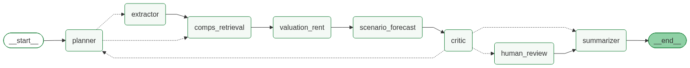

# Carnegie-Mellon Agentic AI Program: Capstone Checkpoint 7.1

# Multi-Family Residential Deal Evaluator
**Author:** Jelani Gould-Bailey  
**GenAI Research Assistance:** Anthropic Claude Opus 5  
**Coding Assistance:** Claude Code  
**Last Major Update:** Sept 4, 2026

## 1\. Project Title

Multi-Family Residential Deal Evaluator

## 2\. Problem and user

*State the real-world problem your autonomous system addresses. Identify the intended user or users, and explain why this problem matters.*

This 7-agent system is designed to create a report to help residential real estate investors evaluate small multi-family (2-4 unit) properties as investment opportunities. Provided with a property listing as input, this agentic system automates and reasons through the process needed to create an investor-facing summary. This includes extracting deal terms from a listing, retrieving relevant comps, estimating rent and value using real-world data, forecasting multiple scenarios, and authoring the aggregated, transparent deal report. This can help investors make decisions on whether a property is a good fit for them.

One challenge that exists today in making these determinations is that the small multi-family segment does not have as much available data as single-family homes. Creating a robust evaluation requires several kinds of judgment and sources of data: comparable-property analysis, rent estimation, and forward-looking scenario forecasting (rent growth, appreciation, holding period). Individual investors typically do this manually, using rules of thumb and static calculators. The Multi-Family Residential Deal Evaluator takes away the manual effort in this process, equipping the human investor to make an informed final decision (buy or pass).

### User Base:
There are 3 intended users of this system: 

1. The Investor: the person who will read the final report and decide whether to invest. The Investor is the "end user" / customer / client. Clean reports are ready to go to the Investor without edits.
2. The Real Estate Agent: the person who will present the final report to the investor. The system has automated quality checks in place for the final report. Certain flags will result in routing the report draft to the Real Estate Agent for human review, to decide how to frame the findings and disclosures appropriately.
3. The IT Specialist: the person who supports the Real Estate Agent and will step in if there are certain system-generated errors during the report generation which require a closer look.

Why an agent and not a spreadsheet? Because the arithmetic isn't the hard part. The hard part
is what to do when the evidence runs thin. Widen the comparable search, or report that you
couldn't? Trust the listing's stated rent, or the model's? Those are sequential decisions
where each one changes the next — and every one of them needs to be disclosed.

## 3\. System goal and scope

*Explain what your system is designed to do, what successful performance looks like, and any important boundaries or constraints you defined.*

The system is designed to ingest a text-based residential multi-family property listing and use it to generate a text-based report for The Investor. Successful performance would be a final report which includes data about the property and suitable comparables, a rent-growth forecast and a value-appreciation (sales) forecast. The report should also transparently include any disclosures for noteworthy or challenging things that were encountered during report generation. Depending on the nature and number of disclosures, the report may be flagged for closer review by either the Real Estate Agent or the IT Specialist.

The final report should clearly state 2 verdicts: ***"Can the system stand behind its own numbers?"*** and ***"Is this a good deal?"***

The system is not scoped to evaluate single-family homes or large commercial properties (e.g. apartment buildings with > 4 units).

## 4\. Final system architecture

*Describe the final design of your system and how its major components work together. Depending on your project, this may include reasoning loops, memory, tools, retrieval, Tree-of-Thought reasoning, multi-agent coordination, guardrails, logging, evaluation, and human intervention.*

The Multi-Family Residential Deal Evaluator uses a seven-agent pipeline, orchestrated as a [LangGraph](https://github.com/langchain-ai/langgraph)
state graph with an explicit human-in-the-loop pause:

### Agents

*Generated from the compiled graph, not drawn. Dotted edges are conditional.*

1. **Planner**: runs pre-flight: it inspects the deal and decides which downstream steps are needed. 
2. **Extractor**: parses an unstructured listing into typed deal terms and geocodes the address — and where it has to assume something, it says so.
3. **Retrieval**: performs RAG over a rental corpus in a vector store; when matches are sparse it relaxes its criteria one step at a time and flags each concession it makes. 
4. **Valuation**: runs a custom gradient-boosted rent model anchored to a market rent index at the target property's ZIP code.
5. **Forecast**: performs Tree-of-Thought reasoning over rent-growth and price-appreciation scenarios, scored by an LLM and pruned to a beam of survivors.
6. **Critic**: checks consistency *across* agents, aggregates every disclosure into a confidence score, and can either send the deal back to the Planner — a bounded cycle — or escalate it to a human.
7. **Summarizer**: renders the final report, surfacing every upstream disclosure rather than only the headline numbers.

### Architectural principles

**1. Transparent Degradation, enforced structurally rather than by discipline.** Whenever an agent proceeds on incomplete, relaxed, or stale evidence, it attaches a named, severity-graded flag to its output instead of absorbing the gap. Flag kinds come from a closed enum — there are 30 — which is what makes coverage of the system's own failure modes countable rather than asserted. Flags accumulate through an append-only LangGraph reducer, so a downstream node can add to the disclosure record but cannot overwrite it: the one failure that would defeat this principle is impossible by construction. A dedicated test suite asserts that a flag raised in the first agent survives every downstream node and reaches the report.

**2. Two questions that are never merged.** *"Can the system stand behind its own numbers?"* is a statement about the software; *"Is this a good deal?"* is a statement about the property. Different rules compute them, they render as two separate lines, and either is allowed to be bad while the other is good. The Staten Island sample report is the case that forced the separation: zero comparables found, so the system escalates — while the property asks 17% below its ZIP median.

**3. Every figure traces to a public source, and the line between real and synthetic is stated.** Zillow's rent index, HUD Fair Market Rents, Redfin's sale-price series, New York City and Cook County assessor transaction records, and the Census geocoder and boundary layers are all real and all free. The subject listings are synthetic — these properties are not for sale — and each is calibrated against a real public benchmark and labeled as such. Two rules fall out of this and are treated as invariants: a sale-price series may never touch a rent dollar figure, and every rent number passes through market-index normalization before it reaches a reader. The comp corpus is real but 2018–19 vintage, so an unanchored figure taken from it would be a 2019 number presented as today's.

**4. Claims are held on measurement, not on argument.** Roughly thirty single-purpose evidence scripts sit beside the pipeline, each answering one question and writing its answer down. The rent model is reported under 5-fold cross-validation with every row scored out-of-fold, and reported *per metro* rather than pooled, because the pooled figure hid the result the change was made for. The escalation threshold was swept over a fixed batch rather than tuned against fixtures I wrote myself. The consequence of this habit is that several confident assumptions were caught and reversed: my original metro trio failed a listing-density check, New York was assumed to be the sparse market and Staten Island turned out to be, and the rent-versus-price correlation the forecast's pairing logic rested on was re-measured and found to be an artifact of the rent series rather than a fact about the market.

**5. Reproducibility is a design property.** All 30 evaluation rows and all three sample reports replay from a fresh clone with no live model call; reaching a live model takes an explicit flag. A missing recording is a hard error, never a silent fall-through to a live call — a mixture of fresh and recorded samples reported as one number is exactly the kind of quiet degradation this system exists to refuse.

### Reasoning

A full run makes seven model calls, across four of the seven agents. Naming them precisely matters, because "agentic" is easy to claim and hard to point at — and the honest inventory is smaller and more specific than the word implies.

| Agent | Calls | What the model is asked for | What it cannot do |
| --- | --- | --- | --- |
| **Extractor** | 1 (+ schema-repair retries) | Turn an unstructured listing into typed deal terms, naming its own assumptions and clarifying questions | Estimate a value the listing does not state |
| **Forecast** | 4 — two per beam level, two levels | Choose which read-only evidence tools to pull; then score enumerated candidates 0.0–1.0 with a rationale | Propose a growth rate. The space is enumerated, not sampled |
| **Critic** | 1 | Reach its own verdict on the deal from the same evidence the rule read | Change the verdict. It annotates; the rule decides |
| **Summarizer** | 1 | Write the report's opening paragraph | Reach a conclusion or choose what the report contains |

**Three loops genuinely iterate, and two of them contain no model at all.** The schema-repair loop feeds a Pydantic `ValidationError` and the rejected response back into the prompt, so the model is told precisely what was wrong. The adaptive retrieval loop concedes exactly one search criterion per pass, names what it gave up, and re-queries the index with the adapted parameters — a single prompt has no way to inspect the result of its own retrieval and adjust. The bounded rework cycle lets the Critic observe contradictions that exist only in the *combination* of upstream disclosures and choose between reporting, one more pass, and escalation. Every one is bounded by an explicit counter.

**Where a model was deliberately declined is the more load-bearing half.** The confidence score, the escalation rule, the Planner's routing, and the buy/pass recommendation are all deterministic functions over accumulated state. That is a decision taken on evidence, not a gap: this model scores an identical prompt 0.05 on one call and 0.95 on the next at temperature 0, so a recommendation behind it would make the same deal proceed on Tuesday and not on Wednesday, and the evaluation harness could score neither outcome. **The through-line is that the model proposes and the rules decide** — every model call is either upstream of a rule or beside one, and none of them is the last word on anything a reader acts on.

## 5\. Design evolution across the program

*Review your earlier checkpoints and explain how your system evolved from Module 1 through Module 6. Highlight the most important refinements, additions, or changes, and explain why they improved the system.*

The pipeline's shape has barely moved since Module 2 — seven agents, one back edge, one human-review pause. What changed is almost everything underneath it, and in every case the change was forced by a measurement rather than chosen from a plan.

| Module | The refinement that mattered |
| --- | --- |
| **1** | Metros locked early, on measured listing density rather than on housing-stock intuition |
| **2** | Named the failure a prompt-only version cannot avoid — fabricated grounding at full confidence — and made disclosing it the system's organizing principle |
| **3** | Retrieval built and measured against an ungrounded baseline; the adaptive relaxation loop added |
| **4** | Tree-of-Thought adopted for one node of seven, over an enumerated rather than sampled space |
| **5** | Coordination settled: pre-flight Planner, append-only state, one bounded cycle |
| **6** | Guardrails, the evaluation harness, and three independent escalation grounds |
| **7** | Two axes separated, a second reasoning locus added, and the rent model and its anchor both replaced on measurement |

**The data sources kept moving toward the estimate, and each move was made against a number.** The system began anchoring rent to HUD Fair Market Rents, county-level and annual. Building the evaluation harness surfaced the defect: the federal schedule had risen **+51.9%** since the corpus vintage while market rent rose **+33.5%**, an 18-point bias sitting invisibly inside every estimate. The anchor is now a hybrid — Zillow's rent index for the market *level* at the subject's own ZIP, HUD for the bedroom *step*, which Zillow does not publish. Both ends read the index at the same month, so a drifting schedule now divides out where it arises instead of being corrected after the fact. Per metro that bought New York $981 → $855 and Chicago $454 → $343 while the pooled figure stayed flat, which is exactly why per-metro reporting became standard. The same argument then applied to the forecast: rent *growth* moved off HUD too, and the price side gained a sub-metro benchmark built from 44,981 county-assessor sales in New York and Chicago, replacing a metro median that described properties an hour apart with one number.

**I did not build several planned capabilities, because the data would not support them.** ZIP-level appreciation was in the plan until the extract turned out to carry a **median of two sales per ZIP-period** — a growth rate computed off that is noise wearing a finer grain. A property-level value estimate was dropped for the same class of reason and the field left permanently empty, with a labeled market benchmark carried in its place. Tree-of-Thought was specified for two nodes and shipped in one: once the Critic's checks were written against a running system, all of them turned out to be pure deterministic functions with nothing to search over. And the system still computes no cap rate, because this project has no operating-expense data and will not invent one — it reports a gross rent multiplier instead and says what it is refusing and why. **In each case the honest move was to delete the capability and disclose the gap rather than ship a plausible number.**

**The evaluation harness went from a batch runner to the thing every claim in this project is measured against.** It started as engineered listings, each built to trip one named flag; coverage of the 30 defined disclosure kinds began at **17 of 28** and now stands at **30 of 30**, none uncovered and none unreachable. Closing that gap changed the system rather than just the score — writing cases against the uncovered scenarios exposed a gate in front of two Critic checks that should not have been there, and removing it made a previously silent deal escalate. The harness also caught itself twice: an entire tier of cases was making live model calls while the documentation claimed it did not, and the fix was applied to two tiers of three, so the same defect stood for another unit and quietly published a comp count no clone could reproduce. Every one of the 30 rows now re-derives from a fresh clone.

**The rent model moved from linear regression to gradient boosting on cross-validated evidence, and the better-scoring model was not the one taken.** A single 20% holdout was replaced with 5-fold cross-validation, and three forms were scored under it: linear regression at **$513.67** MAE, random forest at **$428.83**, gradient boosting at **$450.71**. Random forest won on error and lost on its train-versus-holdout gap — **$140.41** against gradient boosting's **$18.34** — so I gave up 5% of error for a roughly eight-fold tighter gap. That change then broke a guardrail silently, which is the part worth keeping: the model's refusal to price an implausible subject had only ever worked because a *linear* model extrapolates without limit, and a 2-bedroom, 100,000 sq ft listing that the old model refused came back from the new one at a perfectly reportable ratio. A guardrail that depends on an implementation detail of the thing it guards fails silently by definition, so it was rebuilt to ask the question directly — *does this subject resemble the training data?* — and pinned by a named test.

**Transparent Degradation grew from a convention into a typed, routed, countable object.** It began as "append a flag to a list." It became a closed enum so coverage could be counted; then severity grades so a single disqualifying observation could escalate on its own rule rather than through a threshold; then pass-scoped stamps, because an append-only list cannot distinguish *raised this pass* from *ever raised*, so a rework that succeeded still re-raised the objection it had been sent back to fix; then a scope classifier separating disclosures about *this property* from disclosures about *its market*; and finally a desk classifier, so a pause names whether it is waiting on IT or on the real-estate agent. The last two additions came from reading generated reports, not from running tests — which is also how the two most serious defects in this build were found.

## 6\. Implementation overview

*Summarize how you built the system. Include the frameworks, tools, models,application programming interfaces (APIs), or libraries you used, and explain how they support your design.*

The whole system is Python 3.13 in a single virtualenv. I adopted LangGraph on day one rather than staging a migration into it, because the staged plan was the only option that required building the orchestration layer twice.

**Orchestration and state.** LangGraph `StateGraph` with eight nodes — the seven agents plus the human-review pause — conditional edges for every routing decision, and a SQLite checkpointer. State is one Pydantic v2 object. Two framework properties earned the dependency: `Annotated[list[Flag], operator.add]` makes the disclosure channel append-only *by construction*, and `interrupt()` is a first-class pause-and-resume primitive that is genuinely error-prone to hand-roll. Every agent is a plain function — state in, **partial** state update out — holding no framework-specific code, so the reasoning would port to a hand-rolled loop if LangGraph became a liability.

**LLM access.** OpenRouter through the OpenAI-compatible SDK, `nvidia/nemotron-3-nano-30b-a3b` at temperature 0. I moved to paid model variants early and for a sharper reason than speed: the free tier serves from provider-shared pools, so two bake-off passes disagreed about which models even worked and one model behaved differently on its free and paid variants given an identical prompt. **Free-tier access was satisfiable on quality and not on the ability to measure anything.** Total spend against the $100 budget is **$10**, at roughly $0.00015 per extraction. A wrapper adds the schema-validated retry loop; a separate on-disk cache runs in one of three modes — off, read/write, or replay — and replay treats a miss as a hard error.

**Retrieval.** ChromaDB (persistent, cosine distance) over **3,880 listings** across four markets and 166 ZIP-code tabulation areas, one document per listing and never chunked. Embeddings are `sentence-transformers/all-MiniLM-L6-v2`, run locally and free. The query is **hybrid**: hard constraints — geography, bedroom count, an optional size band — run as exact metadata filters, while embedding similarity ranks whatever survives them over description and amenity text. The subject's quantitative attributes are deliberately kept *out* of the embedded query, so fuzzy matching cannot reintroduce error into constraints that were already exact. Chroma cannot express a radius query, so the agent narrows with a bounding box and trims to the true circle with an exact haversine distance.

**The rent model.** `scikit-learn`'s `GradientBoostingRegressor` at library defaults, with `pandas` and `numpy` behind it. Three structural features — bedrooms, bathrooms, square feet — and **no market identifier by design**, so all locational information arrives through the anchor rather than through the model. The target is a *ratio* of rent to that anchor rather than a dollar figure, which is what lets a model trained on 2018–19 listings be applied to today's index. Trained on **5,701 rows** across 13 counties and 166 ZCTAs; the artifact is ~140 KB and is committed, so a fresh clone can score a listing.

**Data sources and APIs.** All free and all public: the **HUD Fair Market Rent API** (bedroom-level rent schedules, with a caching client), **Zillow ZORI** (ZIP-level monthly rent index, 8,543 series), **Redfin Data Center** filtered to 2–4 unit multi-family (sale-price series), the **Census Geocoder** (address to coordinates, with a corpus-centroid fallback and a committed disk cache), **Census TIGER boundary layers** for coordinate-to-ZIP and coordinate-to-county resolution by point-in-polygon join via `geopandas`, and **New York City and Cook County open-data assessor records** for ZIP-level sale benchmarks. The rental corpus is a Kaggle apartment-listings dataset, 99,492 rows before cleaning.

**MCP.** `mcp_server.py` exposes four read-only tools over the HUD and Redfin clients, each annotated `readOnlyHint`, verified over a real stdio handshake, and returning provenance rather than bare values. The forecast's evaluator builds its own tool menu from the server's `list_tools()` and dispatches to those same functions in-process, so there is **one definition of the tool surface rather than two that can drift**. I did not route those calls over JSON-RPC to a subprocess: it buys no capability while costing an async rewrite and a new critical-path failure mode. The pipeline does not require MCP — what it buys is portability and a second consumer.

**Observability.** LangSmith tracing, wired through every node and env-driven. It is opt-in rather than required, and every run prints whether it is tracing, so a silently uncaptured run is not a failure mode.

**Demo surface.** A local Streamlit app over the same compiled graph. It replays from committed recordings by default and says so; it pauses for review genuinely, naming which desk it is waiting on and carrying the reviewer's typed note into the report verbatim; and it can simulate three failures no listing can produce on demand — an unreachable model, an address-lookup outage, a stale market index — each of which names itself in the report, so a demonstration cannot be mistaken for a real incident.

**Testing and evaluation.** `pytest`, 107 hermetic tests across seven files with no network access. Coverage is deliberately scoped rather than exhaustive; two suites are load-bearing and never cut — flag propagation, and the evaluation harness described in §7.

### Project Stats

| Measure | Value |
| --- | --- |
| Lines of Python (excluding blanks) | 25,372 across 84 files — of which **14,894 is code**, 6,522 docstrings, 3,956 comments |
| Commits · active span | 165 · 27 days (Aug 8 – Sept 3, 2026), all authored by me |
| Agents · graph nodes · cycles | 7 · 8 · 1 back edge, asserted on every diagram export |
| Typed disclosure kinds | 30 |
| Numbered design decisions | 22, each with its full reasoning recorded |
| Evaluation cases · demo listings | 30 · 8 |
| Tests collected | 107 |
| Comps indexed · training rows | 3,880 · 5,701 |
| Spend against the $100 budget | **$10** |

## 7\. Evaluation and results

*Explain how you evaluated your system. Describe the criteria, tests, or examples you used to assess performance, reliability, and limitations. Summarize the main results.*

**Every evaluation number comes from a batch harness that invokes the same compiled graph the production entry point runs**, so a result cannot come from a parallel code path that has drifted. The batch is **30 cases across three tiers**: golden fixtures where complete deal terms are supplied and the Extractor is skipped, replay cases where the Extractor runs against recorded model responses, and the eight demo listings plus one ablation. Twenty-one of the 30 are engineered — each written to trip one specific disclosure — and **all 30 replay from a fresh clone with no live model call**, because the recordings, the fixtures, and even the geocoder cache are committed alongside the results.

**The design property that makes the batch usable for tuning rather than only for demonstration is that a case declares what should happen to it before the run.** This matters because the two obvious ways to build such a batch are both self-confirming: demo listings are calibrated to run *clean*, and engineered listings are calibrated to *fail* — the same error with the sign reversed, and more dangerous because it is called an evaluation. So each engineered case states its expected outcome up front, under a triage rule fixed in advance: if the target disclosure fired but the verdict disagrees, that is a signal about the threshold; if the target disclosure did not fire, the case is wrong rather than the threshold.

### Main results

| Criterion | What it asks | Result |
| --- | --- | --- |
| **Verdict agreement** | Does the report-or-escalate decision match the verdict declared before the run? | **20 of 23** scored cases; all three disagreements triaged individually |
| **Disclosure coverage** | How many of the 30 typed disclosure kinds does the batch actually exercise? | **30 of 30 raised**, 0 uncovered, 0 unreachable |
| **Parameter robustness** | How far can the escalation threshold and severity weights move before the batch decides anything differently? | **63 of 160** swept configurations decide all 21 cases identically; through the shipped point the threshold moves 0.30–0.70 and the warn weight 0.100–0.200 with no verdict changing |
| **Rule independence** | Does the critical-disclosure rule do work the confidence score does not? | The critical weight is **inert across its whole range, including zero** — every deal carrying one escalates on the independent rule regardless |
| **Regression** | Do previously published rows reproduce on a fresh build? | **6 of 7**; the one that moved is a deliberate change |
| **Rent accuracy** | Cross-validated error, per market | **$452 MAE** pooled against a $590 mean-ratio baseline (**23.3%** better), R² 0.409; Chicago $343, Cleveland $357, Los Angeles $509, **New York $855** |
| **Transfer** | What does the model cost in a market it has never seen? | **$512/mo** pooled under leave-one-metro-out — a **13%** transfer cost — and it beats a predict-the-average baseline in **all nine** held-out markets |
| **Groundedness** | Retrieval on versus off, identical subject | 8 of 8 retrieved comps exist in the evidence base; **0 of 8** ungrounded ones do |
| **Search value** | Does the forecast's beam search beat a linear chain? | Across four subjects it kept the first-enumerated framing **0 times** and chose the all-diagonal pairing **0 times**; on Cleveland the base case differs by −22.0% on rent and +26.4% on price |

**Two results are load-bearing beyond their own row.** The first is the **critical-weight sweep**: setting the cost of a critical disclosure to zero changes no verdict, which is direct evidence that the escalation rule does something the confidence score alone cannot. This is not a redundancy — it is the fix for a real defect. A single critical disclosure costs 0.40, landing confidence at exactly 0.60, and `0.60 < 0.60` is false, so a deal with **zero comparables** and a deal with **no resolvable coordinates** both reported as ordinary. A threshold is simply the wrong tool for a single disqualifying observation, and the batch now measures the separation rather than asserting it.

The second is the **groundedness ablation**, which is the evidence the whole retrieval design rests on. An ungrounded model produced eight comparables at *high* stated confidence, none of them checkable. One returned address is not merely wrong but impossible: Echo Park Avenue's house numbers top out in the 2300s, and the model returned 5678 — the second element of the `1234 / 5678 / 9101` sequence that **both** tested models emitted independently. The most robust finding was vintage-independent: fabricated comp sets spread roughly a fifth as widely as real ones (coefficient of variation 3.1% and 4.3% against the grounded set's 19.7%). **Invented comps are too tidy**, and an investor reading them would conclude the market is far more settled than it is.

### What these numbers do not measure

**The escalation rate is not the system's escalation rate.** Eleven of 21 predicted cases escalate, but 21 of 30 cases were *engineered* to trip a disclosure, so that figure describes the fixtures rather than the agent.

**The sweep measures robustness, not optimality.** A batch that cannot distinguish two settings is not saying they are equally good; it is saying it has no evidence either way. Zero of 21 cases argue that 0.60 is the wrong threshold, so the threshold is **held on measurement** — a deliberately weaker claim than tuning would have been.

**Only one of the two axes is scored.** Verdict agreement measures whether the system can stand behind its own numbers. Whether the *property* is a good buy has no ground truth here: the listings are synthetic, so there is no realized sale to score against, and writing 21 expected recommendations after the rule existed would score the rule against itself. The recommendation is reported in every row and scored in none — and its thresholds were placed on external evidence instead, from **44,358 real transactions across 222 ZIP codes**, which put a 15% premium at the 68th percentile of actual sales and a 50% premium at the 89th.

## 8\. Safety and reliability considerations

*Explain the guardrails, monitoring, fallback logic, and human oversight you included to improve safety and dependability.*

The system includes multiple types of guardrails and fallback logic, including the ability to send the final report for additional adjustment or corrective action.

**The system's entire risk surface is the report.** It takes no action, holds no write access, and buys no property. So the characteristic failure is not a wrong number — it is a wrong number presented as a right one: plausible, well-formatted, confidently stated, with nothing underneath it. Every guardrail below exists because that failure occurred at some point during this build.

### System-level guardrails

**No agent invokes another, and no agent hands data to another.** Every node reads the shared state object and returns a partial update; routing lives in edges and dedicated routing functions, and a routing function returns *the name* of the next node, carrying no payload of its own. A specialist therefore cannot influence what a downstream specialist receives except through the shared record — which is precisely what makes the Critic's cross-agent checks meaningful, because it is checking evidence no upstream agent could have shaped for it.

**Nodes return partial state updates, never the whole mutated object.** This is the most common way to lose data in a graph framework, and it is the one that would silently discard disclosures.

**The disclosure channel is append-only by construction**, through a reducer rather than a convention. A node can add to the flag list; nothing can overwrite it.

**Every cycle is bounded by an explicit counter held in state** — extraction retries at 3, retrieval relaxation at 4, rework passes at 2, search depth at 3 — and never by the framework's recursion limit. Hitting a framework limit raises an opaque exception; a counter escalates to human review gracefully, and exhausting one is itself a disclosed outcome.

**The tool surface is read-only by construction.** All four MCP tools are annotated read-only, and there is no write tool anywhere in the system. A tool that fails returns a reason rather than raising.

### Agent-level guardrails

**Extraction is schema-validated with bounded retries, then refuses.** A response that fails validation is not swallowed — the validation error text and the rejected response are appended to the prompt and re-sent, so the model is told exactly what was wrong. After three attempts the agent writes **no deal terms at all** and raises a critical disclosure. There is deliberately **no fallback parser**: the original regex parser was deleted rather than kept, because a fallback that runs only on failure is a fallback nobody maintains.

**The geocoder declines to invent a coordinate.** Three tiers — parcel match, city centroid, or nothing — and the tier that fired is always disclosed.

**Errors are classified as retryable or not, and only the first earns a rework pass.** An unreachable geocoder may answer on the next call; an address with no street number will not improve on a retry, and neither will a genuinely thin market. A rework pass may legally take a *different route* than the first for exactly this reason.

**Retrieval concedes one criterion at a time and names each concession.** On a shortfall the agent relaxes exactly one search criterion, raises a flag saying what it gave up, and re-queries. On exhausting its budget it exits with whatever it found plus a sparse-comps disclosure rather than presenting a thin set as a full one. It then measures what the widening actually *admitted*, which is a separate question from whether it happened — relaxing a filter permits dissimilar comps without producing them, so only measured drift raises the drift disclosure.

**A subject unlike the training data is refused, not priced.** The training feature ranges travel on the model artifact, and a subject outside them — square feet, bedrooms, bathrooms, and most importantly square-feet-per-bedroom outside the 0.1st-to-99.9th percentile band of the training frame — gets no estimate and a critical disclosure. This guardrail was rebuilt after it failed silently when the model form changed, and it is now pinned by a named test.

**Every rent figure passes market-index normalization before it reaches a reader**, and a sale-price series may never touch a rent dollar figure.

### Escalation to a human

**Three independent conditions pause the graph** at a genuine `interrupt()` rather than degrading the output: accumulated uncertainty (confidence below 0.60), **any single critical disclosure regardless of score**, and an exhausted rework budget with an objection still outstanding.

Three details matter as much as the criteria. **Escalation is checked before rework**, so a deal a person should see reaches one rather than being quietly re-run first. **The pause surfaces grounds, not state** — the confidence score, every warn-or-critical disclosure, and any unanswered clarifying questions, rather than a state dump a reviewer cannot act on. And **a reviewed deal still produces a report, with its status remaining `needs_review` after sign-off**, which preserves the distinction between *"the system was confident"* and *"a person signed off."*

**A pause names which desk it is waiting on, derived from the kinds of disclosure that caused it.** Infrastructure disclosures — the geocoder was unreachable, the extraction model was down, no rent index covers this county — route to **the IT Specialist**: nothing about the deal is in question, and re-running it once the resource is back may be all that is needed. Deal-substance disclosures — sparse comps, a comp set widened onto a different kind of unit, a rent estimate diverging from its own cross-check — route to **the Real Estate Agent**: the system worked correctly and found something in this specific deal that a person should judge. The desk name appears in the pause payload and deliberately *not* in the rendered report, which is written for the Investor and carries no internal routing vocabulary.

**The cost of all this is over-escalation, and it is taken knowingly.** A deal carrying one critical disclosure stops even when the confidence score would have cleared it. For an investment tool the cost of being wrong is asymmetric, and a system that occasionally stops a deal a person need not have seen is better than one that occasionally reports a deal with nothing underneath it.

## 9\. Limitations and next steps

*Identify the current limitations of your system and suggest realistic next steps for improving it.*

This is a seven-week capstone build, not a production system, and the limitations below are disclosed deliberately rather than hidden. Each is tracked in the repository's open-questions register with what would close it, because a deferral recorded without a closing condition is indistinguishable from one that was forgotten.

### Data limitations

**The comp corpus is 2018–19 vintage and 91% one aggregator**, so eight comparables are less independent than the count implies. Vintage is handled by design — the model learns a rent-to-index *ratio* and applies it to today's index — but that central assumption is bounded rather than verified. Testing it properly needs current-vintage unit-level rents this project does not have; it was falsified cheaply instead over the corpus's own 13-month window, at a **+3.6%** cost to extrapolating in time. That is a floor the assumption clears, not a demonstration that it holds over seven years.

**The rent model has never priced a market outside its training set, and transfer costs about 13%.** Every market this system indexes *is* in the training set, so the cross-validated figure is the right one to publish — but it says nothing about a new market, and the leave-one-metro-out figure is an upper bound for one rather than an estimate.

**New York carries the largest per-market error at $855/mo, and more New York data would not fix it.** Removing New York from training entirely moves that figure only to $875 — a 2% transfer cost, against Los Angeles's 19%. So the elevated error is within-ZIP rent dispersion that three location-blind features cannot recover: a permanent property of this feature set, disclosed on every New York report rather than carried as work outstanding.

**The sub-metro sale benchmark covers two markets of four.** California assessors publish assessed value under Proposition 13 rather than transaction price, so Los Angeles and Cleveland fall back to a metro median, with the reason disclosed on each deal.

**There is no cap rate or net operating income**, because this project has no operating-expense data — taxes, insurance, vacancy, maintenance — and will not invent one. What it computes instead is a gross rent multiplier built on the *modelled* rent rather than the listing's claimed rent, so it is available even on a listing that states none.

### Reasoning and reporting limitations

**The forecast's pairing step rests on a weaker relationship than it was designed for.** The measured rent-versus-price correlation explains under a tenth of the variance and changes sign by market, so the step that pairs a rent band with a price band has no directional rule behind it. It is disclosed as thin rather than presented as settled reasoning — and it was found by *re-measuring* a premise the design had asserted once and never checked.

**The report's written summary is model-generated, and its prose is not verified.** The figures it quotes are taken from the computed result and are checked; the sentences around them are not. It is additive by construction — it renders the verdict the rule reached, cannot change it, and every disclosure it summarizes is printed in full directly beneath it — so no reader depends on it. During development it twice described *rental* comparables as recorded sales before the prompt was restructured.

**Live model calls are not perfectly deterministic, even at temperature 0.** Diagnosed with a direct experiment rather than left as a guess: OpenRouter routes "the same model" to different backend deployments per request, and even pinned to one fixed deployment, scores swing from 0.05 to 0.95 on the same prompt. Committed recordings are exact regardless, so this touches only live runs. It is accepted as a property of a stochastic model rather than treated as a defect — but the open question is what it implies about the system's own resilience, and that has not been answered.

**The forecast's rent bands are read at county grain while the rent estimate is anchored at ZIP grain**, because ZIP-level rent-index coverage is too thin to forecast from — 65–95% of ZIPs in this project's markets have series beginning after 2018.

**The relaxation ladder concedes the strongest measured attribute first.** Retrieval relaxes floor area, then radius, then bedrooms — an order inherited from an early unit on the reasoning that floor area was the weakest signal. The shipped rent model measures square footage at **0.502** importance against bedrooms at **0.300**. The order is wrong and is tagged at the site.

**The report is long** — the three sample reports run 183 to 213 lines — and every recent change added to the middle without removing anything. A length pass was declined before the freeze for a specific reason: almost everything it would cut is a disclosure, and a shorter report bought by dropping the caveat beside a number is the failure this system exists to prevent.

**Test coverage is deliberately scoped rather than exhaustive.** Two suites are load-bearing and never cut; broad unit coverage was a deliberate trade, not an oversight.

### Next steps

1. **Expose the pipeline itself as an MCP-callable capability.** This is the strongest next step because half the plumbing already exists and is tested: the read-only reference server already exposes this project's data tools to an external host. The unbuilt half is the inverse — exposing *the evaluation* as something another agent could invoke on a person's behalf, which is the fourth persona the design names and does not yet support.
2. **Make the relaxation choice a per-deal judgment.** *Which* criterion to concede is a real decision with alternatives and a measurable outcome — a thin-but-dense ZIP wants the radius held and the size band conceded, while a subject with an unusual footprint wants the reverse. It is the strongest candidate for a fifth reasoning locus in the system, and it should be taken only after the fixed order is corrected and comp comparability is measured.
3. **Close the transfer question properly** with hyperparameter tuning and feature engineering under the same cross-validation. Both were cut inside the freeze because either would change the shipped model and force a re-record of all 30 evaluation rows.
4. **Split the report by audience.** One rendering currently serves an investor and a reviewing agent with different needs. The cheap fix — collapsing more of the middle — is presentation; the useful one is deciding what a reader of *many* of these actually re-reads, which needs evidence from a reader who has read many and does not exist yet.
5. **Sample the forecast's scorer more than once and disclose disagreement**, rather than trusting a single draw from a model measured to be unstable at temperature 0.
6. **Add operating-expense data** — the one addition that would let the system move from a gross rent multiplier to a real return figure, and the change most likely to matter to the investor reading it.

## 10\. Public GitHub repository

*Prepare a public GitHub repository for your capstone project, and include the link in your final report. Your repository should make it possible for a technical audience to understand your project and review your implementation. At a minimum, it should include:*
1. A README that explains the project, problem, architecture, setup steps, and usage
2. The main code or notebooks for your system
3. Any sample inputs, outputs, or evaluation artifacts you want to share
4. Clear instructions for running or reviewing the project

---

**Repository: <https://github.com/jelanigb/carnegie-mellon-agentic-ai>** (public, MIT licensed)

**1. README** — [`README.md`](https://github.com/jelanigb/carnegie-mellon-agentic-ai/blob/main/README.md). It explains the project, the architecture, setup and usage, and it is written for *reviewing* rather than running: it leads with where the evidence already lives, and closes with a plain statement of the system's limitations.

**2. Primary source code** — [`src/`](https://github.com/jelanigb/carnegie-mellon-agentic-ai/tree/main/src). The seven agents are in [`src/agents/`](https://github.com/jelanigb/carnegie-mellon-agentic-ai/tree/main/src/agents), the graph assembly in [`src/graph.py`](https://github.com/jelanigb/carnegie-mellon-agentic-ai/blob/main/src/graph.py), the state schema in [`src/state.py`](https://github.com/jelanigb/carnegie-mellon-agentic-ai/blob/main/src/state.py), and every tunable parameter in [`src/config.py`](https://github.com/jelanigb/carnegie-mellon-agentic-ai/blob/main/src/config.py) — a value hardcoded inside an agent is treated as a defect here, not a shortcut.

**3. Sample inputs** — the eight demo listings live in [`src/demo_deals.py`](https://github.com/jelanigb/carnegie-mellon-agentic-ai/blob/main/src/demo_deals.py), and [`docs/demo.md`](https://github.com/jelanigb/carnegie-mellon-agentic-ai/blob/main/docs/demo.md) explains in plain language what each one exists to show:

- [**Los Angeles**](https://github.com/jelanigb/carnegie-mellon-agentic-ai/blob/main/docs/demo.md#los-angeles--the-clean-baseline-and-it-only-became-clean-on-aug-30-2026) — the clean baseline: dense market, eight comparables, nothing degraded
- [**Chicago**](https://github.com/jelanigb/carnegie-mellon-agentic-ai/blob/main/docs/demo.md#chicago--the-deal-that-escalated-stopped-and-escalates-again) — a moderate market where retrieval relaxes once
- [**Staten Island**](https://github.com/jelanigb/carnegie-mellon-agentic-ai/blob/main/docs/demo.md#staten-island--new-york--the-real-data-degradation-case) — the real-data degradation case: no comparable listings exist within reach
- [**No Geography**](https://github.com/jelanigb/carnegie-mellon-agentic-ai/blob/main/docs/demo.md#no-geography--nowhere-to-anchor-to) — an address nothing can resolve
- [**Overpriced**](https://github.com/jelanigb/carnegie-mellon-agentic-ai/blob/main/docs/demo.md#overpriced--exercising-the-price-benchmark-disclosure) — the system is confident and the *deal* is the problem
- [**Coordinate Conflict**](https://github.com/jelanigb/carnegie-mellon-agentic-ai/blob/main/docs/demo.md#coordinate-conflict--supplied-coordinates-disagree-with-the-address) — supplied coordinates disagree with the stated address
- [**Chicago Uptown**](https://github.com/jelanigb/carnegie-mellon-agentic-ai/blob/main/docs/demo.md#chicago-uptown--the-second-clean-run-and-the-first-meaningful-proceed) — a second clean run, priced at its ZIP median
- [**Los Angeles (current anchor)**](https://github.com/jelanigb/carnegie-mellon-agentic-ai/blob/main/docs/demo.md#los-angeles-current-anchor--the-same-property-re-based) — the same property with rents re-based on the current index
- [**The retrieval ablation**](https://github.com/jelanigb/carnegie-mellon-agentic-ai/blob/main/docs/demo.md#the-ablation-isolating-the-critical-flag-escalation-rule) — the Chicago deal run without the comp corpus at all

**4. Sample outputs** — three full reports the pipeline produced, committed as-is in [`docs/sample_reports/`](https://github.com/jelanigb/carnegie-mellon-agentic-ai/tree/main/docs/sample_reports). They are chosen so the report's two questions vary independently:

- [**los-angeles.md**](https://github.com/jelanigb/carnegie-mellon-agentic-ai/blob/main/docs/sample_reports/los-angeles.md) — reported at confidence 1.00, *Proceed*: the clean path
- [**staten-island.md**](https://github.com/jelanigb/carnegie-mellon-agentic-ai/blob/main/docs/sample_reports/staten-island.md) — **escalated** at 0.00, and still *Proceed*: **read this one first**, because it is the clearest demonstration that the two questions are separate
- [**overpriced.md**](https://github.com/jelanigb/carnegie-mellon-agentic-ai/blob/main/docs/sample_reports/overpriced.md) — the mirror: reported at 1.00, *Proceed with caution*, because the deal rather than the software is the problem

**5. Evaluation artifacts** — [`src/eval/results/results.md`](https://github.com/jelanigb/carnegie-mellon-agentic-ai/blob/main/src/eval/results/results.md) (the 30-row batch and the flag-coverage census) and [`src/eval/results/sensitivity.md`](https://github.com/jelanigb/carnegie-mellon-agentic-ai/blob/main/src/eval/results/sensitivity.md) (the parameter sweep). The inputs behind them — golden fixtures, recorded model responses, the geocoder cache — are committed in [`src/eval/data/`](https://github.com/jelanigb/carnegie-mellon-agentic-ai/tree/main/src/eval/data).

**6. Review instructions** — [README § *Where the evidence already lives*](https://github.com/jelanigb/carnegie-mellon-agentic-ai/blob/main/README.md#where-the-evidence-already-lives) is the intended entry point, and [README § *Running it*](https://github.com/jelanigb/carnegie-mellon-agentic-ai/blob/main/README.md#running-it) carries the commands.

**A note on what a fresh clone can and cannot run, because it is a deliberate choice rather than an omission.** Two things are not committed. The first is the **source rental corpus and the vector index built from it** — the corpus is Kaggle-licensed, and redistributing it inside a public repository is not mine to do; the README names where it comes from and the index rebuilds from one script once the CSV is in place. The second is the **rent model's training data**, for the same reason — though the *trained* model artifact ships, so scoring a listing works out of the box.

**The evaluation is the deliberate exception, and it is the part a reviewer should run.** Its inputs are committed in full, so `python -m eval.runner --tier golden` reproduces every figure quoted in §7 from a fresh clone, with **no external calls, no API keys, and no missing data**. That reproducibility is the whole point of the tier split: a number whose inputs and outputs cannot be re-derived is an assertion rather than evidence.